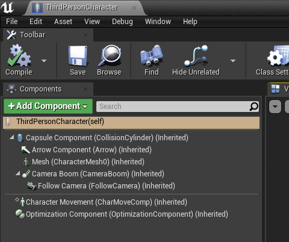

# NPC Optimizator
# What is it?
NPC Optimizator it is a plugin for UE4 provide you automatic flexible optimization for your NPCs
# Features

* Automatic NPC optimization based on Character & Pawn class
* Huge amount of setting for balancing quality & performance
* No limitations for NPC logic
* Plugin optimize skeletal meshes (and attached static meshes), movement component & ai controller
* You can choose the components for optimization yourself using the special tag
* Easy integration
* Up to 6x faster on average (out of box)
* Fully written in C++
* Works theoretically on all platforms (Win32,Win64, Mac, Linux, Android, IOS approved)
* Allows to use for optimization of any characters with skeletal meshes, including in multiplayer games
* This plugin doesn't just remove and spawn bots for $100, it really optimizes them.
* Supports integration with Advanced Locomotion System (and with many others)

# How it is work?

The plugin in a separate thread checks the distance from the player's camera to the bot and whether it is currently in the camera's field of view. Based on this information, the bots are split into waves. There are five waves of optimization in total:

1.  Without optimization, these are the bots closest to the player, which should be of maximum quality. All optimizations are disabled for them.
2. The first wave of optimization. By default, these are bots within a radius of 15 to 25 meters. On this wave, optimizations are applied according to the component settings. By default, shadows are turned off, animations, ticks, and so on are simplified.
3. The second wave of optimization. By default, these are bots within a radius of 25 to 35 meters.
4. The third wave of optimization. By default, these are bots within a radius of 35 meters to the maximum visible distance (default 85 meters)
5. The fifth wave of optimization is all bots out of the player's field of vision or too far away from him

After the bots have been separated into waves, they update certain parameters in the next frame - this process is called synchronization with the main thread of the game. The number of bots updated at a time per frame is configured by the console command

Green boxes - no optimization, blue boxes - first wave, yellow boxes - second wave, gray boxes - third wave, red boxes - invisible bots

# Installation

First you need to install the plugin on the engine. You can do this through the official epic games launcher.

## Using plugin as project plugin

If you want use plugin as project plugin you can manually copy plugin from “**Engine/Plugins/Marketplace/NPCOptimizator**” folder to you “**Project/Plugins/NPC Optimizator**” folder

## Example project

Also if you want you can download an [example project](https://drive.google.com/drive/folders/175GC8IDsI1tim_76gNv-0c8qyXBe_OzL).

# Integration into your project

## Blueprint project

1. Open your NPC blueprint

2. Add component “**Optimization proxy**”

3. That’s all, you can jump to game and see performance boost

## CPP Project
1. Add NPC Optimizator to your project plugins folder 

2. Add NPC_Optimizator to your game dependency modules (inside YOUR_GAME.Build.cs file) (don't forget to enable the plugin in the project file)

3. Include “NPC_Optimizator/Public/OptimizationComponent.h” to your character or pawn class

4. Add UOptimizationProxyComponent  to your class

5. Initialize it in constructor 

6. That’s all, you can build it & test in game

# Component settings

Optimization component have a huge number of settings for balancing between quality and performance.

**General settings**

**Distance to first optimization** - Distance from the player camera to the NPC at which the first wave of optimizations is activated. Bots closer to this distance are not optimized.

**Distance to second optimization** - Distance from the player camera to the NPC at which the second wave of optimizations is activated.

**Distance to third optimization** - Distance from the player camera to the NPC at which the third wave of optimizations is activated.

**Max visible distance** - Distance after which NPC become completely invisible

**Optimization  based on** - Distance calculation type. From the player or from the camera

**Use optimization by tag** - If enabled component will be optimize only components with special tag

**Optimization tag** - special tag for components which need to be optimized (skeletal meshes/static meshes attached to skeletal meshes)

**Ignore Optimization Tag** - special tag to ignore any component optimizations

**Disable movement when invisible** - Disables the movement of NPC that are currently invisible. Enabling this option greatly improves performance. With a large number of bots that need to enable / disable movement, it can create small jumps in frames. To prevent this, use the console variable: npc.optimizator.MaxOptimizedOnOneFrame

**Disable skeletal mesh tick when invisible** - Disables ticking of skeletal meshes that are currently invisible. Enabling this option greatly improves performance. With a large number of bots that need to turn on / off the tick, it can create small jumps in frames. To prevent this, use the console variable:  npc.optimizator.MaxOptimizedOnOneFrame

**Hide all attached static meshes** -  Set it if you want to hide all static meshes attached to skeletal meshes (when owner skeletal meshes are going to hide state). If you need hide only special static meshes disable this flag & use Optimization Tag for it

**Disable Optimizations On Listen Server** -  When using a listener server, there are moments when the client-server does not see bots and because of this, other players have visual glitches, to avoid this, bots on the listener server ignore any optimizations

**Waves settings**

These settings are applied to optimization waves. You can adjust this for each wave separately.

**Movement optimizations**

**Always check floor** - Whether we always force floor checks for stationary Characters while walking.Normally floor checks are avoided if possible when not moving, but this can be used to force them if there are use-cases where they are being skipped erroneously (such as objects moving up into the character from below).

**Enable physics interaction** - If enabled, the NPC will interact with physics objects when walking into them.

**Max simulation timestep** -  Max delta time for each discrete simulation step. Used primarily in the more advanced movement modes that break up larger time steps (usually those applying gravity such as falling and walking). Lowering this value can address issues with fast-moving objects or complex collision scenarios, at the cost of performance.

**Max simulation iterations** - Max number of iterations used for each discrete simulation step. Used primarily in the more advanced movement modes that break up larger time steps (usually those applying gravity such as falling and walking). Increasing this value can address issues with fast-moving objects or complex collision scenarios, at the cost of performance.

**Run physics with no controller** - If true, movement will be performed even if there is no Controller for the Character owner. Normally without a Controller, movement will be aborted and velocity and acceleration are zeroed if the character is walking. Characters that are spawned without a Controller but with this flag enabled will initialize the movement mode to DefaultLandMovementMode or DefaultWaterMovementMode appropriately.

**Movement mode** - Character movement type

**Sweep while nav walking** -  Whether or not the character should sweep for collision geometry while walking.

**Fixed movement tick** - Tick time for movement component when random tick disabled

**Min movement random tick** - Minimum value for random tick

**Max movement random tick** - Maximum value for random tick

**Use random movement tick** - Enable random movement component tick

**Skeletal mesh optimizations**

**Hide shadows** - Whether it is necessary to turn off shadows on this wave

**Disable mesh collision** - Whether it is necessary to turn off the collision of the mesh on this wave \
**Need hide static meshes** -Whether or not the character should hide attached static meshes on this wave

**Use URO (Update Rate Optimization)** - if true, the owner will determine how often animation will be updated and evaluated. This allows skipping frames for performance. (For example based on visibility and size on screen).

**Use per bone motion blur** - If true, use per-bone motion blur on this skeletal mesh (requires additional rendering, can be disabled to save performance)

**Disable cloth simulation** - Whether it is necessary to disable cloth simulation on this wave

**Disable morph target** - Disable morph Target on this wave

**Skip kinematic update when interpolating** - Whether to skip UpdateKinematicBonesToAnim() when interpolating. Kinematic bones are updated to the target interpolation pose only on ticks when they are evaluated.

**Skip bounds update when interpolating** -  Whether to skip bounds update when interpolating. Bounds are updated to the target interpolation pose only on ticks when they are evaluated.

**Allow rigid body anim node** - Sets whether or not to allow rigid body animation nodes for this skeletal mesh

**Generate overlap events** -  If true, this component will generate overlap events when it is overlapping other components (eg Begin Overlap). Both components (this and the other) must have this enabled for overlap events to occur.

## Debug draw settings

**No Optimization Draw Debug** - Enable/disable draw debug for NPC without any optimization. Green boxes

**First Wave Draw Debug** - Enable/disable draw debug for NPC in first wave. Blue boxes

**Second Wave Draw Debug** - Enable/disable draw debug for NPC in second wave. Yellow boxes

**Third Wave Draw Debug** - Enable/disable draw debug for NPC in third wave. Gray boxes

**Invisible Draw Debug** - Enable/disable draw debug for invisible NPC. Red boxes

## Help functions

**Disable All Optimizations** - Help function for disable all optimization for character (It is recommended to use it when the bot goes into the state of death)

**Enable optimizations** - Help function for enable optimizations after disabling 

## Component events

**On Change Wave** event - very helpful event for creating custom logic for optimization. Executed when component going to new optimization wave

# Troubleshooting

## Ragdoll issues

If your project uses ragdoll when a character dies, then when you switch to this state, you may have visual buggies with a body flying into the air. This is because the "**Allow rigid body anim node**" is disabled by default for optimization. There are two ways to solve this problem:

1) Enable "**Allow rigid body anim node**"

2) Call the function “**Disable All Optimizations**” before entering the ragdoll state

## ALS integration

Since **Advanced Locomotion System** uses several skeletal meshes, and when replacing one of them, it is required to hide one of them by default, there are problems with displaying this mesh after optimization. To avoid this, use a special tag to ignore mesh optimization - "IgnoreOptimization". Example:

# Console variables

npc.optimizator.fov (default 90) - Used for setting FOV for optimization

npc.optimizator.MaxOptimizedOnOneFrame (default 15) - How many bots can be optimized in one optimization thread tick. A lower value reduces the synchronization delay with the main thread, but worsens the visual quality

npc.optimizator.DrawDebug (default 0) - Forcing debug rendering for all optimized NPC

# Statistic

You can enable the display of optimization statistics using the console command : stat NPC_Optimizator

Where :
**Manager Thread tick** - Optimization thread execution time
**Manager Optimization tick** - Execution time for optimization calculation

**Optimization Sync with Game thread** - Time for sync changes between optimization thread and game thread

**Optimization Skeletal meshes** - Time for apply changes to skeletal meshes

**Optimization Movement** - Time for apply changes to movement component

**NPC count (all with optimization)** - the total number of NPC with the optimization component enabled

**NPC count Invisible** - the total number of invisible NPC

**NPC count Without optimization** - the total number of NPC without any optimizations

**NPC count First wave** - the total number of NPC in first wave

**NPC count Second wave** - the total number of NPC in second wave

**NPC count Third wave** - the total number of NPC in third wave

# FAQ

Q: **What exactly does your plugin optimize?** 
A: Skeletal meshes, movement & ai controller components

Q: **Can I use the plugin to optimize characters in my multiplayer game?**

A: Yes you can, but try not to use the disabling movement component. The plugin works for a local player and shouldn't break your game logic.

Q: **Are there any restrictions on the logic of my bots?**

A: No, no limitations for any logic

Q: **What platforms are supported?**

A: Now it is Win32,Win64, Mac, Linux, Android, IOS - tested & worked. Potentially it should work on any platform. If you have any problems with platforms - please write me, I  will be fixt it

# Support

If you have any additional questions or suggestions, do not hesitate to express them. You can

do it through my official discord group or via email

**Discord** : [https://discord.gg/4FtCJnMuxb](https://discord.gg/4FtCJnMuxb)

**Email** : [support@space-raccoon.com](mailto:support@space-raccoon.com)
